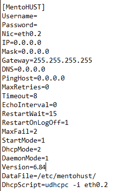

# RuiJie-gzhu (unavailable after 2021-04-03)
Bypass Ruijie v6.84 based on Openwrt

**Great Appreciation for [ysc3839](https://github.com/ysc3839/openwrt-minieap/tree/gzhu) and [Lean](https://github.com/coolsnowwolf/lede)**

**[中文文档](./README_zh.md)**

***

+ **[Preparation](#preparation)**

+ **[Build](#build)**

+ **[Usage](#usage)**

+ **[Supplement](#supplement)**

***

## Preparation

+ `A router that can be flashed and run Openwrt`  


+ `Ubuntu 64bit (Ubuntu 18 LTS x64 recommend)`  


+ `Conditions to bypass GFW globally`  


+ If you use `VMware Workstation Pro` to build, please make sure it has at least **50GB** of storage space *(20GB as default)*  


**My Compiling Environment**
+ VMware Workstation 16 Pro  
`Ver: 16.0.0 build-16894299`

+ Ubuntu image  
`Ver: 18.04.5`

***
## Build

**1. Prepare your compilation environment**

**2. Download the required packages**
```bash
cd ~ # or the PATH you want in /home/

sudo apt-get update

sudo apt-get -y install build-essential asciidoc binutils bzip2 gawk gettext git libncurses5-dev libz-dev patch python3.5 python2.7 unzip zlib1g-dev lib32gcc1 libc6-dev-i386 subversion flex uglifyjs git-core gcc-multilib p7zip p7zip-full msmtp libssl-dev texinfo libglib2.0-dev xmlto qemu-utils upx libelf-dev autoconf automake libtool autopoint device-tree-compiler g++-multilib antlr3 gperf wget swig rsync
```
<br>

---

**DO NOT USE `sudo` or `root` USER IN THE FOLLOWING STEPS**  
**DO NOT USE `sudo` or `root` USER IN THE FOLLOWING STEPS**  
**DO NOT USE `sudo` or `root` USER IN THE FOLLOWING STEPS**  

---

<br>

**3. Get the source code of `Openwrt`**

```bash
git clone https://github.com/coolsnowwolf/lede
```


**4. Enter the file directory of `lede` and get all the latest package definitions and install symlinks of all of them**


**NOTE:** If you would like to use some plug-ins such as `S*R-PLUS` , you should edit the file `feeds.conf.default` or `feeds.conf` and uncomment the line with the word `helloword` (the last line usually) before running `./scripts/feeds update -a`  

```diff
src-git packages https://github.com/coolsnowwolf/packages
src-git luci https://github.com/coolsnowwolf/luci
src-git routing https://git.openwrt.org/feed/routing.git
src-git telephony https://git.openwrt.org/feed/telephony.git
src-git freifunk https://github.com/freifunk/openwrt-packages.git
#src-git video https://github.com/openwrt/video.git
#src-git targets https://github.com/openwrt/targets.git
#src-git management https://github.com/openwrt-management/packages.git
#src-git oldpackages http://git.openwrt.org/packages.git
#src-link custom /usr/src/openwrt/custom-feed
- #src-git helloworld https://github.com/fw876/helloworld
+ src-git helloworld https://github.com/fw876/helloworld
```
*The **one** step **above here** is optional*

```bash
cd ./lede/
./scripts/feeds update -a
./scripts/feeds install -a
```


**5. Integrate the source code of `Minieap` && `Luci-Minieap` into `Openwrt`**

```bash
git clone https://github.com/ysc3839/openwrt-minieap.git -b gzhu package/minieap
git clone https://github.com/ysc3839/luci-proto-minieap.git package/luci-proto-minieap
```
**NOTE:** Pay attention to the `gzhu` branch

**6. Configure and Choose the packages that you want**

```bash
make menuconfig
```


**NOTE:** 
+ Choose **the correct** `Target System` , `Subtarget` and `Target Profile` for your router  
+ In order to bypass the Ruijie, you should choose `minieap` in section `Network` and `luci-proto-minieap` in section `LuCI` -> `Protocols`  

    [More information for the other packages](https://www.right.com.cn/forum/thread-344825-1-1.html)


**7. Dowload some required library**  
*(Run with bypassing GFW globally)*

```bash
make -j8 download V=s
```


**8. Compile**  
*(Run with bypassing GFW globally)*

```bash
make -j1 V=s    # -j1 single thread is recommended for the first compilation
```
*Usually takes 2 ~ 3 hours to compile for the first time*

**9. Wait then Find your firmware and packages in `$YOURPATH(~ as default)/lede/bin/targets` and `$YOURPATH(~ as default)/lede/bin/packages`**

***

## Usage

#### Login the Openwrt

+ Default login IP address : 192.168.1.1
+ Default login password : password

#### Configure the Openwrt and Minieap

1. Click `Network` -> `Interface` -> `LAN` to change the default IP address for logging in Openwrt (192.168.1.1 as default)


2. Make sure `WAN` runs `DHCP` protocol    
Create a new interface with the name `$whateveruwant`  
Click and modify the new interface you create  


3. Switch to `MINIEAP Client`  
Type in your account and password (same as ruijie client) and choose `rjv3` in `Packages Plug-in`  
Click `RJv3 plug-in Setting`  
Choose `Ruijie Private` in `EAP Broadcast Address` and `Twice Certification` in `DHCP Mode`  
Click `Physical Settings`  
Choose the `VLAN` that runs `DHCP` *(eth0.2 as default)* 


4. Save and Apply


5. Click [Here](https://github.com/H0uzC) to test the Internet


## Supplement


+ Recompile  

```bash
cd lede
git pull
./scripts/feeds update -a && ./scripts/feeds install -a
make defconfig
make -j8 download
make -j$(($(nproc) + 1)) V=s
```


+ Remake Menuconfig

```bash
rm -rf ./tmp && rm -rf .config
make menuconfig
make -j$(($(nproc) + 1)) V=s
```


+ `MentoHUST` Config Provided by [lomoyi](https://github.com/lomoyi)

