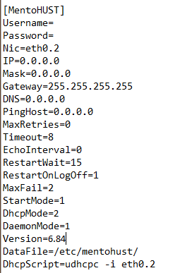

# RuiJie-gzhu
基于Openwrt固件的绕过锐捷 v6.84验证教程

**特别感谢： [ysc3839](https://github.com/ysc3839/openwrt-minieap/tree/gzhu) , [Lean](https://github.com/coolsnowwolf/lede)**

***

**[准备](#准备本地编译环境)**

**[编译](#编译)**

**[使用](#使用)**

**[补充](#补充)**

**[不想或无法准备本地编译环境](#如果你不想或无法准备本地编译环境)**

***

## 准备本地编译环境

+ `一台可以被刷固件和运行Openwrt的路由器`  


+ `Ubuntu 64bit (推荐 Ubuntu 18 LTS x64)`  


+ `全局绕过GFW的网络条件`  


+ 如果你使用 `VMware Workstation Pro` 来编译, 请确保至少分配 **50GB** 的存储空间 *(默认 20GB)*  


**我的编译环境**
+ VMware Workstation 16 Pro  
`Ver: 16.0.0 build-16894299`

+ Ubuntu image  
`Ver: 18.04.5`

***
## 编译

**1. 准备好你的编译环境**

**2. 下载编译所需的包**
```bash
cd ~ # or the PATH you want in /home/

sudo apt-get update

sudo apt-get -y install build-essential asciidoc binutils bzip2 gawk gettext git libncurses5-dev libz-dev patch python3.5 python2.7 unzip zlib1g-dev lib32gcc1 libc6-dev-i386 subversion flex uglifyjs git-core gcc-multilib p7zip p7zip-full msmtp libssl-dev texinfo libglib2.0-dev xmlto qemu-utils upx libelf-dev autoconf automake libtool autopoint device-tree-compiler g++-multilib antlr3 gperf wget swig rsync
```
<br>

---

**请确保在接下来的步骤一定 不要 使用 `sudo`命令 或者 `root` 用户**  
**请确保在接下来的步骤一定 不要 使用 `sudo`命令 或者 `root` 用户**  
**请确保在接下来的步骤一定 不要 使用 `sudo`命令 或者 `root` 用户**  

---

<br>

**3. 获取 `Openwrt` 的源码**

```bash
git clone https://github.com/coolsnowwolf/lede
```


**4. 进入`lede`的文件夹并执行**

**提示:** 如果你想使用一些如 `S*R-PLUS` 的插件, 你需要在执行`./scripts/feeds update -a` 之前修改 `feeds.conf.default` 或者 `feeds.conf` 文件：取消有 `helloword` (通常为最后一行)字样所在行的注释 

```diff
src-git packages https://github.com/coolsnowwolf/packages
src-git luci https://github.com/coolsnowwolf/luci
src-git routing https://git.openwrt.org/feed/routing.git
src-git telephony https://git.openwrt.org/feed/telephony.git
src-git freifunk https://github.com/freifunk/openwrt-packages.git
#src-git video https://github.com/openwrt/video.git
#src-git targets https://github.com/openwrt/targets.git
#src-git management https://github.com/openwrt-management/packages.git
#src-git oldpackages http://git.openwrt.org/packages.git
#src-link custom /usr/src/openwrt/custom-feed
- #src-git helloworld https://github.com/fw876/helloworld
+ src-git helloworld https://github.com/fw876/helloworld
```
*取消注释部分👆为选做，如果你不知道这是什么*  
*请直接忽略并执行👇*

```bash
cd ./lede/
./scripts/feeds update -a
./scripts/feeds install -a
```


**5. 在`Openwrt`的`package`中添加 `Minieap` 和 `Luci-Minieap`插件**

```bash
git clone https://github.com/ysc3839/openwrt-minieap.git -b gzhu package/minieap
git clone https://github.com/ysc3839/luci-proto-minieap.git package/luci-proto-minieap
```
**提示:** 注意并且确保 `minieap`拉取的是 **`gzhu`** 分支

**6. 配置并选择你想要的软件插件**

```bash
make menuconfig
```


**NOTE:** 
+ 为你的路由器选择 **正确的** `Target System`,`Subtarget` 的 `Target Profile`
+ 为了绕过锐捷验证, 你需要选择在 `Network`中的`minieap`和在`LuCI` -> `Protocols`中的 `luci-proto-minieap`

    [更多其他软件插件的信息](https://www.right.com.cn/forum/thread-344825-1-1.html)


**7. 下载dl库**  
*(确保网络条件为全局绕过GFW)*

```bash
make -j8 download V=s
```


**8. 编译**  
*(确保网络条件为全局绕过GFW)*

```bash
make -j1 V=s    # -j1 single thread is recommended for the first compilation
```
*第一次编译通常需要2~3个小时*

**9. 等待然后在 `$YOURPATH(~ as default)/lede/bin/targets` and `$YOURPATH(~ as default)/lede/bin/packages`中寻找你的固件和软件ipk**

***

## 使用

#### 登录 Openwrt

+ 默认登录IP  : 192.168.1.1
+ 默认登录密码 : password

#### 配置 Openwrt 和 Minieap

1. (选做)点击 `网络`->``->`LAN` 来更改登录Openwrt的IP地址 (默认为192.168.1.1)


2. 确保 `WAN` 运行 `DHCP`    
   新建一个叫`$whateveruwant`的接口修改你新建的接口  


3. 修改你新建的接口  
   接口协议选择 `MINIEAP Client`  
   输入你的校园网账号和密码并且在 `Packages Plug-in`中选择 `rjv3`  
   点击`RJv3 plug-in Setting`  
   在 `EAP Broadcast Address`中选择 `Ruijie Private`  
   在 `DHCP Mode` 中选择`Twice Certification`  
   点击`Physical Settings`并选择运行着`DHCP`的`VLAN` *(一般是 eth0.2)*  


4. 保存并应用


5. 点击 [Here](https://github.com/H0uzC) 测试网络


## 补充


+ Recompile  

```bash
cd lede
git pull
./scripts/feeds update -a && ./scripts/feeds install -a
make defconfig
make -j8 download
make -j$(($(nproc) + 1)) V=s
```


+ Remake Menuconfig

```bash
rm -rf ./tmp && rm -rf .config
make menuconfig
make -j$(($(nproc) + 1)) V=s
```


+ `MentoHUST` Config Provided by [lomoyi](https://github.com/lomoyi)




+ 如果你已经有一台运行着Openwrt的路由器，实现绕过锐捷认证的功能只需安装minieap相关的IPK包即可，可参照 [此文](https://github.com/ysc3839/openwrt-minieap/tree/gzhu) 编译出IPK包  


+ `Releases` 已有支持MT7621系列CPU（如NEWIFI D2）和RedmiAC2100的固件  
***

## 如果你不想或无法准备本地编译环境

推荐使用 **P3TERX** 的 [Actions-Openwrt](https://github.com/P3TERX/Actions-OpenWrt) 进行线上自动编译

**为了实现绕过锐捷验证的功能**，请参照本文`编译`部分的`第五步`并结合`Actions-Openwrt`中的`添加额外的软件包`来编译固件